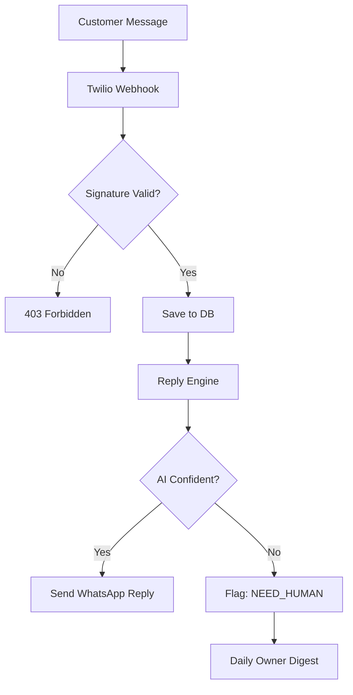

# Million-Dollar SaaS Transformation Plan: WhatsApp AI Support

## 🎨 Professional Design System (Color Psychology)
To build a "million-dollar" brand, the UI must feel both **familiar** (WhatsApp) and **premium** (Enterprise AI).

| Color | Hex | Role | Psychology |
| :--- | :--- | :--- | :--- |
| **WhatsApp Green** | `#25D366` | Primary Accents / Buttons | Familiarity, Trust, Action |
| **Enterprise Blue** | `#0052FF` | Secondary Accents / Links | Reliability, Innovation, Tech |
| **Deep Slate** | `#121B22` | Navigation / Text | Authority, Sophistication, Stability |
| **Soft Background** | `#F8F9FA` | Page Background | Cleanliness, Focus, Modernity |
| **Error Red** | `#FF3B30` | Alerts / Needs Human | Urgency, Attention |

### Typography
- **Primary Font:** `Inter` or `Geist` (Modern, highly readable sans-serif).
- **Headings:** Bold Slate for a strong hierarchical feel.

---

## 🏗️ Technical Architecture Improvements

### Backend (Node.js/Express)
The current structure is flat. We will move to a **Controller-Service-Repository** pattern.
1.  **Routes:** Define clean RESTful endpoints (`/api/v1/...`).
2.  **Controllers:** Handle HTTP logic (req/res).
3.  **Services:** Move heavy lifting (AI logic, Twilio calls) here.
4.  **Middleware:** Centralized error handling and authentication.

### Frontend (Modern Vanilla + Tailwind)
Instead of a framework like React (which adds complexity), we will use **Tailwind CSS** via CDN or Build for the MVP to ensure high speed and professional look.
- **Layout System:** A consistent sidebar-based navigation for the dashboard.
- **Real-time Feedback:** Use Fetch API with proper "Loading..." states and "Success" toasts.

---

## 🚀 Go-Live Checklist (The Path to Revenue)

### 1. Infrastructure
- [ ] **Hosting:** Deploy to **Railway.app** (Automated builds, easy environment management).
- [ ] **Database:** Move to **Supabase Postgres** (Managed, high availability).
- [ ] **SSL:** Automated certificates via Railway/Cloudflare.

### 2. Integration Setup
- [ ] **Twilio:** Switch from Sandbox to a **Live WhatsApp Business Number**.
- [ ] **Paystack:** Move from Test keys to **Live keys** for real Naira transactions.
- [ ] **Claude/Gemini:** Ensure billing is active for API tokens.

### 3. Reliability & Monitoring
- [ ] **Logging:** Implement a basic logger (Winston or simple file logs) to track AI failures.
- [ ] **Health Checks:** Monitor the webhook endpoint to ensure no messages are missed.
- [ ] **Human Handoff:** Ensure the "Need Human" digest is firing daily.

---

## 🗺️ Mermaid Workflow: Message Processing

